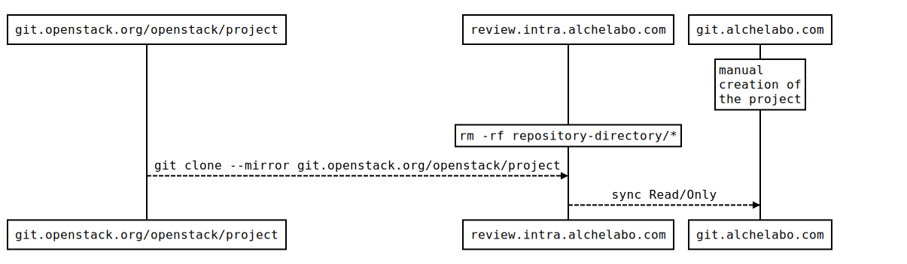
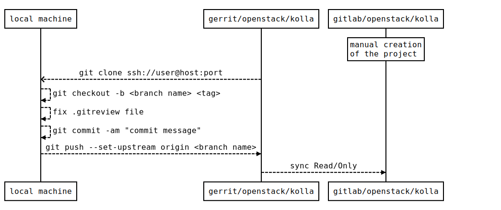
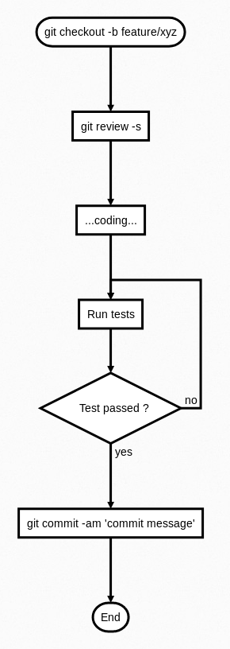

The Continuous Integration/Continuous Delivery infrastructure, is made of required several components ....

###  Initial sync from git.openstack.org

The first step is the creation of a internal code repository. We setup two separated repositories, 
one playing the role of the master, with regular reads/writes, while the other one to play the role 
of backup node, where every change on the master is replicated. The former resides at the host 
`review.intra.alchelabo.com` and the latter at the address `git.alchelabo.com`. 
Along with the need to have a Source Code Management system, we also wanted to be able to review the 
code before merging it to the *master* branch. *Gerrit* is the tool that we choose to accomplish this
task. In our infrastructure, Gerrit is deployed on the node `review.intra.alchelabo.com`.

It's important to highlight that this process is executed only once, when the local repository is 
created and the Openstack project cloned. 


The image below shows the execution flow.



After the creation of a new repository, Gerrit creates a folder named `[repository name].git`. Before 
the clone operation is mandatory to empty the directory otherwise *git* will raise the error 
`fatal: destination path '[repository].git' already exists and is not an empty directory.`. Afterwards 
it is possible to copy the remote code locally. 

For completness here is reported what the *--mirror* option means, as explained in the *git clone* manual: 

```git
--mirror
    Set up a mirror of the source repository. This implies --bare. Compared to --bare, --mirror not 
only maps local branches of the source to local branches of the target, it maps all refs (including 
remote-tracking branches, notes etc.) and sets up a refspec configuration such that all these refs 
are overwritten by a git remote update in the target repository.
```

Right after the clone is completed, git.alchelabo.com gets aligned automatically, because Gerrit is 
configured to autonomously perform the synchronization of the read/only node.
From now on the content of the .git folder (all its `/refs`, ...) will be update by mean of a 
`git remote update`.


### Creation of a stable branch

After all the repositories have been synched, the setup process moves to the local machine. The initial 
step is to perform a full clone of the project's repository as stored in Gerrit. (Remind to store the SSH 
public key inside Gerrit, so to be able to import the code using the SSH protocol). 

It is important to execute correctly the next phases, to configure .git properly, by setting the our username
and email, so that every commit we will execute from now on will be signed with our credentials. 

```git
git config user.email = write here your desired username
git config user.name = write here the email associated with the account used to access Gerrit
```

After the content has been copied locally, a new *stable* branch is created starting from the latest git tag
created in the openstack project. We used the naming convention `trustack/[openstack release name]` (eg. 
*trustack/pike* for the Openstack release *pike*) for the new stable branch created.

Inside the new stable branch we will update the *.gitreview* file by replacing the value of the *host* key
and adding the default-branch parameter as shown in the two small snapshots.

##### from

```
[gerrit]
host=review.openstack.org
port=29418
project=openstack/kolla.git
```

##### to

```
[gerrit]
host=review.intra.alchelabo.com
port=29418
project=openstack/kolla.git
defaultbranch=trustack/pike
```

Then commit the change by running `git commit -am "Updating .gitreview file for <branch_name>"` with
<branch_name> pointing to the stable branch we created two steps earlier. After the pushing the code back 
to the gerrit node, the modification will be automatically replicated to the git.alchelabo node.
The whole process described is summarized in the next picture:



##### Note:
The reason why a new stable branch gets created locally is because the content we aren't enabled to 


### TAG creation

Once the development process reaches a point that is a .... we can create a tag. Namely a tag is a 
commit that freezes the current status of the stable branch (see step before) and later can be used 
for backtracking to a safe status or for backporting.
The creation of a tag is straightforward and is accomplished by running the command

`git tag -am "<project name> X.Y.Z-tsN release" X.Y.Z-tsN` 

followed by a push to the gerrit node `git push origin X.Y.Z-tsN` with X being the major version number,
Y being the feature version number and Z the patch version number. The identified *ts* stands for 
truestack and the number N is the tag counter, for that X.Y.Z version, and it's incremented for every 
tag that belongs to the same version.


### Development cycle

Here below is pictured what the standard development cycle would look like. 



Assumed that we are on the <stable branch> a new branch is created starting from there. It is important 
to initialize the review phase by issuing the `review -s` command. After the 
